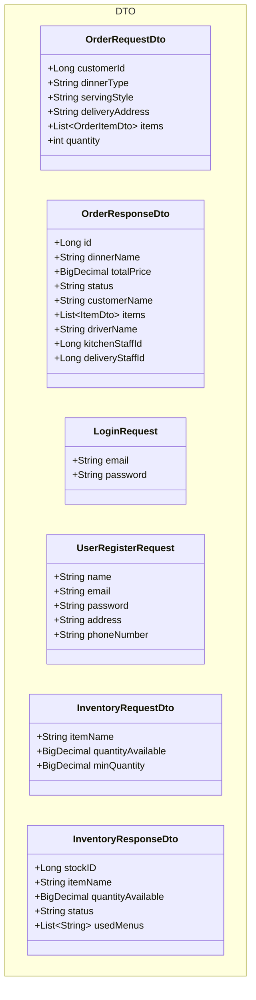

# DTO 패키지 클래스 다이어그램 (DTO Package Class Diagram)

```mermaid
classDiagram
    namespace DTO {
        class OrderRequestDto {
            +Long customerId
            +String dinnerType
            +String servingStyle
            +String deliveryAddress
            +List~OrderItemDto~ items
            +int quantity
        }
        class OrderResponseDto {
            +Long id
            +String dinnerName
            +BigDecimal totalPrice
            +String status
            +String customerName
            +List~ItemDto~ items
            +String driverName
            +Long kitchenStaffId
            +Long deliveryStaffId
        }
        class LoginRequest {
            +String email
            +String password
        }
        class UserRegisterRequest {
            +String name
            +String email
            +String password
            +String address
            +String phoneNumber
        }
        class InventoryRequestDto {
            +String itemName
            +BigDecimal quantityAvailable
            +BigDecimal minQuantity
        }
        class InventoryResponseDto {
            +Long stockID
            +String itemName
            +BigDecimal quantityAvailable
            +String status
            +List~String~ usedMenus
        }
    }
```
