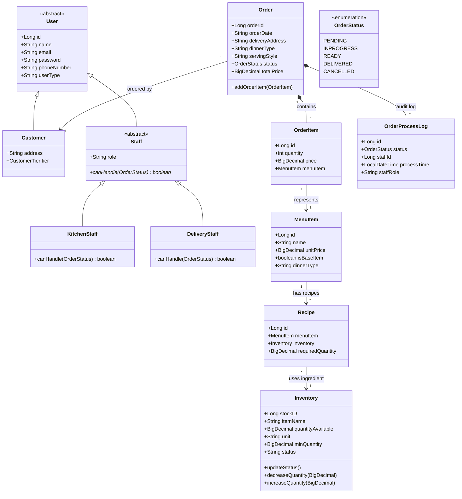

# 도메인 패키지 클래스 다이어그램 (Domain Package Class Diagram)

```mermaid
classDiagram
    %% Domain Entities
    class User {
        <<abstract>>
        +Long id
        +String name
        +String email
        +String password
        +String phoneNumber
        +String userType
    }
    class Customer {
        +String address
        +CustomerTier tier
    }
    class Staff {
        <<abstract>>
        +String role
        +canHandle(OrderStatus)* boolean
    }
    class KitchenStaff {
        +canHandle(OrderStatus) boolean
    }
    class DeliveryStaff {
        +canHandle(OrderStatus) boolean
    }
    
    class Order {
        +Long orderId
        +String orderDate
        +String deliveryAddress
        +String dinnerType
        +String servingStyle
        +OrderStatus status
        +BigDecimal totalPrice
        +addOrderItem(OrderItem)
    }
    class OrderStatus {
        <<enumeration>>
        PENDING
        INPROGRESS
        READY
        DELIVERED
        CANCELLED
    }
    class OrderItem {
        +Long id
        +int quantity
        +BigDecimal price
        +MenuItem menuItem
    }
    class OrderProcessLog {
        +Long id
        +OrderStatus status
        +Long staffId
        +LocalDateTime processTime
        +String staffRole
    }
    
    class MenuItem {
        +Long id
        +String name
        +BigDecimal unitPrice
        +boolean isBaseItem
        +String dinnerType
    }
    class Inventory {
        +Long stockID
        +String itemName
        +BigDecimal quantityAvailable
        +String unit
        +BigDecimal minQuantity
        +String status
        +updateStatus()
        +decreaseQuantity(BigDecimal)
        +increaseQuantity(BigDecimal)
    }
    class Recipe {
        +Long id
        +MenuItem menuItem
        +Inventory inventory
        +BigDecimal requiredQuantity
    }

    %% Relationships
    User <|-- Customer
    User <|-- Staff
    Staff <|-- KitchenStaff
    Staff <|-- DeliveryStaff

    Order "1" --> "1" Customer : ordered by
    Order "1" *-- "*" OrderItem : contains
    OrderItem "*" --> "1" MenuItem : represents
    Order "1" *-- "*" OrderProcessLog : audit log

    MenuItem "1" --> "*" Recipe : has recipes
    Recipe "*" --> "1" Inventory : uses ingredient
```
