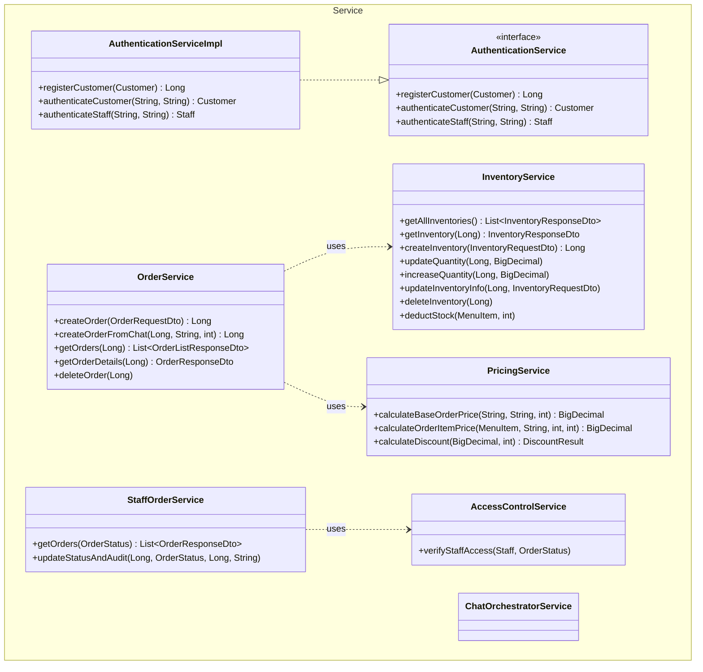

# 서비스 패키지 클래스 다이어그램 (Service Package Class Diagram)

```mermaid
classDiagram
    namespace Service {
        class OrderService {
            +createOrder(OrderRequestDto) Long
            +createOrderFromChat(Long, String, int) Long
            +getOrders(Long) List~OrderListResponseDto~
            +getOrderDetails(Long) OrderResponseDto
            +deleteOrder(Long)
        }
        class StaffOrderService {
            +getOrders(OrderStatus) List~OrderResponseDto~
            +updateStatusAndAudit(Long, OrderStatus, Long, String)
        }
        class InventoryService {
            +getAllInventories() List~InventoryResponseDto~
            +getInventory(Long) InventoryResponseDto
            +createInventory(InventoryRequestDto) Long
            +updateQuantity(Long, BigDecimal)
            +increaseQuantity(Long, BigDecimal)
            +updateInventoryInfo(Long, InventoryRequestDto)
            +deleteInventory(Long)
            +deductStock(MenuItem, int)
        }
        class PricingService {
            +calculateBaseOrderPrice(String, String, int) BigDecimal
            +calculateOrderItemPrice(MenuItem, String, int, int) BigDecimal
            +calculateDiscount(BigDecimal, int) DiscountResult
        }
        class AccessControlService {
            +verifyStaffAccess(Staff, OrderStatus)
        }
        class AuthenticationService {
            <<interface>>
            +registerCustomer(Customer) Long
            +authenticateCustomer(String, String) Customer
            +authenticateStaff(String, String) Staff
        }
        class AuthenticationServiceImpl {
            +registerCustomer(Customer) Long
            +authenticateCustomer(String, String) Customer
            +authenticateStaff(String, String) Staff
        }
        class ChatOrchestratorService
    }
    
    %% Relationships
    AuthenticationServiceImpl ..|> AuthenticationService
    
    OrderService ..> InventoryService : uses
    OrderService ..> PricingService : uses
    
    StaffOrderService ..> AccessControlService : uses
```
