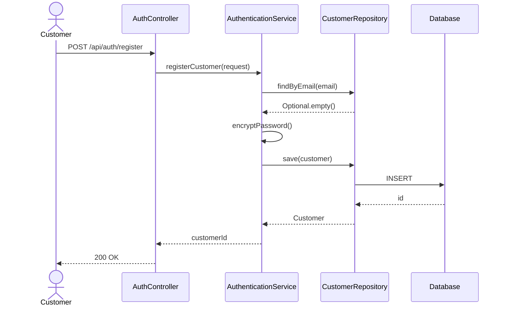
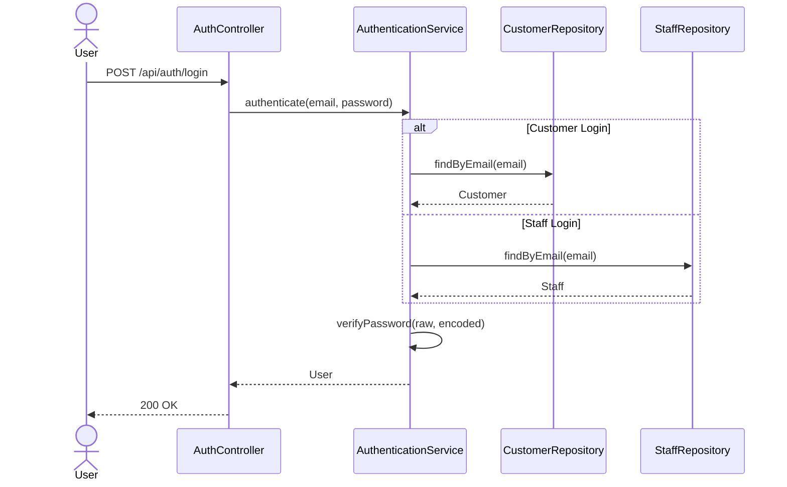
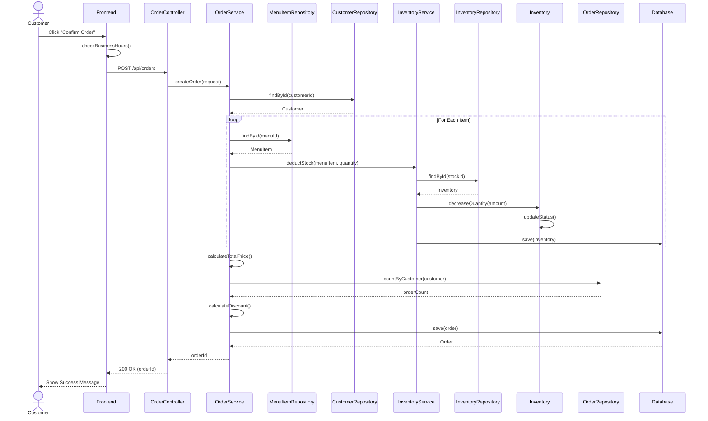
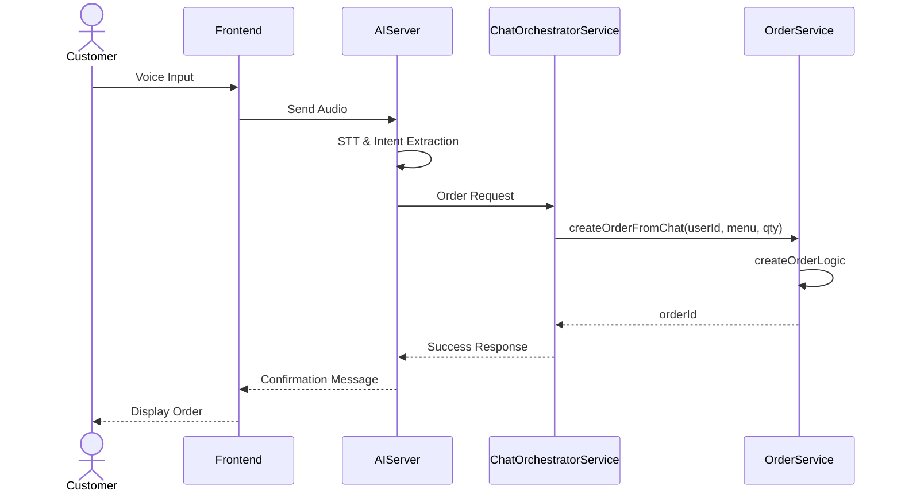
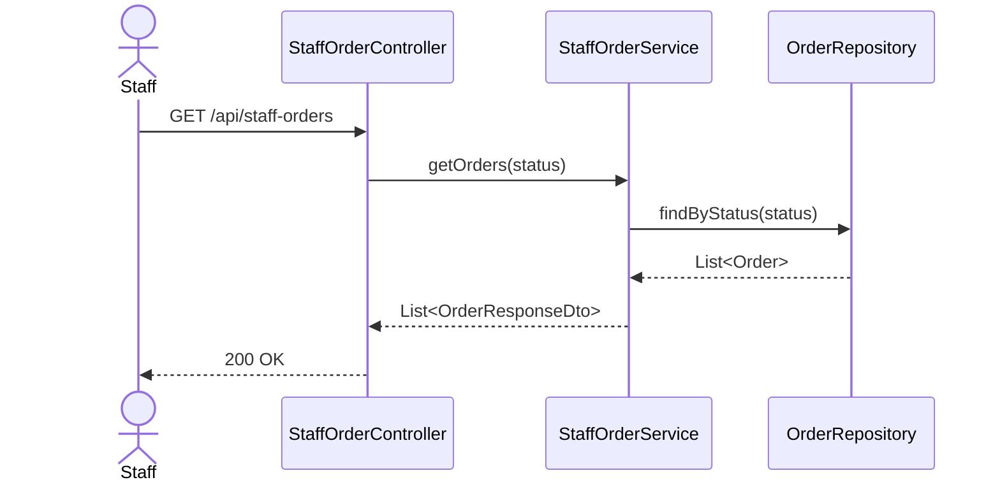
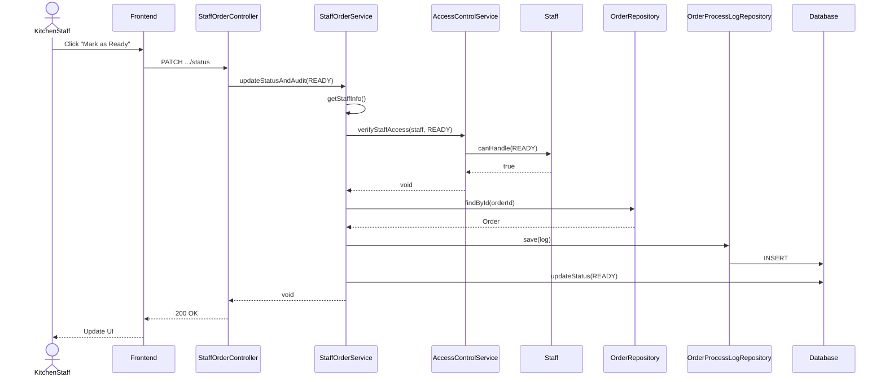
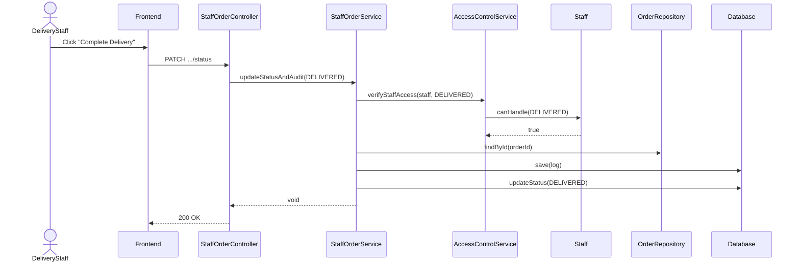
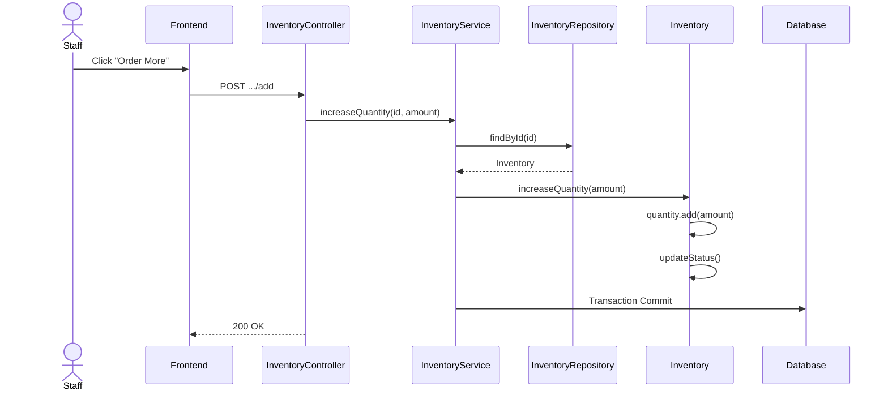

# 시스템 시퀀스 다이어그램 (System Sequence Diagrams)

## 1. 회원가입 (Register)

## 2. 로그인 (Login)

## 3. 주문 확정 (Confirm Order)

## 4. 음성 주문 (Voice Order)

## 5. 주문 내역 조회 (View Orders)

## 6. 주문 상태 변경 - 조리 완료 (Update to Ready)

## 7. 주문 상태 변경 - 배달 완료 (Update to Delivered)

## 8. 재고 관리 - 입고 (Manage Inventory)

