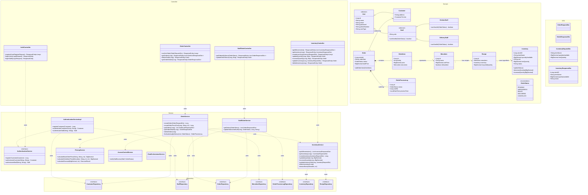

# 전체 시스템 클래스 다이어그램 (System Class Diagram)

```mermaid
classDiagram
    %% Relationships
    User <|-- Customer
    User <|-- Staff
    Staff <|-- KitchenStaff
    Staff <|-- DeliveryStaff

    Order "1" --> "1" Customer : ordered by
    Order "1" *-- "*" OrderItem : contains
    OrderItem "*" --> "1" MenuItem : represents
    Order "1" *-- "*" OrderProcessLog : audit log

    MenuItem "1" --> "*" Recipe : has recipes
    Recipe "*" --> "1" Inventory : uses ingredient

    AuthenticationServiceImpl ..|> AuthenticationService
    AuthenticationServiceImpl ..> CustomerRepository : uses
    AuthenticationServiceImpl ..> StaffRepository : uses

    OrderService ..> OrderRepository : uses
    OrderService ..> CustomerRepository : uses
    OrderService ..> MenuItemRepository : uses
    OrderService ..> InventoryService : uses
    OrderService ..> PricingService : uses

    StaffOrderService ..> OrderRepository : uses
    StaffOrderService ..> StaffRepository : uses
    StaffOrderService ..> OrderProcessLogRepository : uses
    StaffOrderService ..> AccessControlService : uses

    InventoryService ..> InventoryRepository : uses
    InventoryService ..> RecipeRepository : uses

    OrderController ..> OrderService : uses
    StaffOrderController ..> StaffOrderService : uses
    AuthController ..> AuthenticationService : uses
    InventoryController ..> InventoryService : uses

    %% Packages definition using namespaces
    namespace Controller {
        class OrderController {
            +confirmOrder(OrderRequestDto) ResponseEntity~Long~
            +getOrders(Long) ResponseEntity~List~OrderListResponseDto~~
            +deleteOrder(Long) ResponseEntity~Void~
            +getOrderDetails(Long) ResponseEntity~OrderResponseDto~
        }
        class StaffOrderController {
            +getOrdersByStatus(OrderStatus) ResponseEntity~List~OrderResponseDto~~
            +updateOrderStatus(Long, Map) ResponseEntity~Void~
        }
        class AuthController {
            +register(UserRegisterRequest) ResponseEntity~Long~
            +loginUsers(LoginRequest) ResponseEntity
            +loginStaffs(LoginRequest) ResponseEntity
        }
        class InventoryController {
            +getAllInventories() ResponseEntity~List~InventoryResponseDto~~
            +getInventory(Long) ResponseEntity~InventoryResponseDto~
            +createInventory(InventoryRequestDto) ResponseEntity~Long~
            +updateQuantity(Long, Map) ResponseEntity~Void~
            +increaseQuantity(Long, Map) ResponseEntity~Void~
            +updateInventory(Long, InventoryRequestDto) ResponseEntity~Void~
            +deleteInventory(Long) ResponseEntity~Void~
        }
    }

    namespace Service {
        class OrderService {
            +createOrder(OrderRequestDto) Long
            +createOrderFromChat(Long, String, int) Long
            +getOrders(Long) List~OrderListResponseDto~
            +getOrderDetails(Long) OrderResponseDto
            +deleteOrder(Long)
            -findLatestLogByStatus(List, OrderStatus) OrderProcessLog
        }
        class StaffOrderService {
            +getOrders(OrderStatus) List~OrderResponseDto~
            +updateStatusAndAudit(Long, OrderStatus, Long, String)
        }
        class InventoryService {
            +getAllInventories() List~InventoryResponseDto~
            +getInventory(Long) InventoryResponseDto
            +createInventory(InventoryRequestDto) Long
            +updateQuantity(Long, BigDecimal)
            +increaseQuantity(Long, BigDecimal)
            +updateInventoryInfo(Long, InventoryRequestDto)
            +deleteInventory(Long)
            +deductStock(MenuItem, int)
        }
        class PricingService {
            +calculateBaseOrderPrice(String, String, int) BigDecimal
            +calculateOrderItemPrice(MenuItem, String, int, int) BigDecimal
            +calculateDiscount(BigDecimal, int) DiscountResult
        }
        class AccessControlService {
            +verifyStaffAccess(Staff, OrderStatus)
        }
        class AuthenticationService {
            <<interface>>
            +registerCustomer(Customer) Long
            +authenticateCustomer(String, String) Customer
            +authenticateStaff(String, String) Staff
        }
        class AuthenticationServiceImpl {
            +registerCustomer(Customer) Long
            +authenticateCustomer(String, String) Customer
            +authenticateStaff(String, String) Staff
        }
        class ChatOrchestratorService
    }

    namespace Domain {
        class User {
            <<abstract>>
            +Long id
            +String name
            +String email
            +String password
            +String phoneNumber
            +String userType
        }
        class Customer {
            +String address
            +CustomerTier tier
        }
        class Staff {
            <<abstract>>
            +String role
            +canHandle(OrderStatus)* boolean
        }
        class KitchenStaff {
            +canHandle(OrderStatus) boolean
        }
        class DeliveryStaff {
            +canHandle(OrderStatus) boolean
        }
        class Order {
            +Long orderId
            +String orderDate
            +OrderStatus status
            +BigDecimal totalPrice
            +addOrderItem(OrderItem)
        }
        class OrderStatus {
            <<enumeration>>
            PENDING
            INPROGRESS
            READY
            DELIVERED
            CANCELLED
        }
        class OrderItem {
            +Long id
            +int quantity
            +BigDecimal price
            +MenuItem menuItem
        }
        class OrderProcessLog {
            +Long id
            +OrderStatus status
            +Long staffId
            +LocalDateTime processTime
        }
        class MenuItem {
            +Long id
            +String name
            +BigDecimal unitPrice
            +boolean isBaseItem
        }
        class Inventory {
            +Long stockID
            +String itemName
            +BigDecimal quantityAvailable
            +String unit
            +BigDecimal minQuantity
            +String status
            +updateStatus()
            +decreaseQuantity(BigDecimal)
            +increaseQuantity(BigDecimal)
        }
        class Recipe {
            +Long id
            +MenuItem menuItem
            +Inventory inventory
            +BigDecimal requiredQuantity
        }
    }

    namespace DTO {
        class OrderRequestDto
        class OrderResponseDto
        class InventoryRequestDto {
            +String itemName
            +BigDecimal quantityAvailable
            +BigDecimal minQuantity
        }
        class InventoryResponseDto {
            +Long stockID
            +String itemName
            +BigDecimal quantityAvailable
            +String status
        }
    }

    namespace Repository {
        class OrderRepository { <<interface>> }
        class CustomerRepository { <<interface>> }
        class StaffRepository { <<interface>> }
        class MenuItemRepository { <<interface>> }
        class InventoryRepository { <<interface>> }
        class RecipeRepository { <<interface>> }
        class OrderProcessLogRepository { <<interface>> }
    }
```
