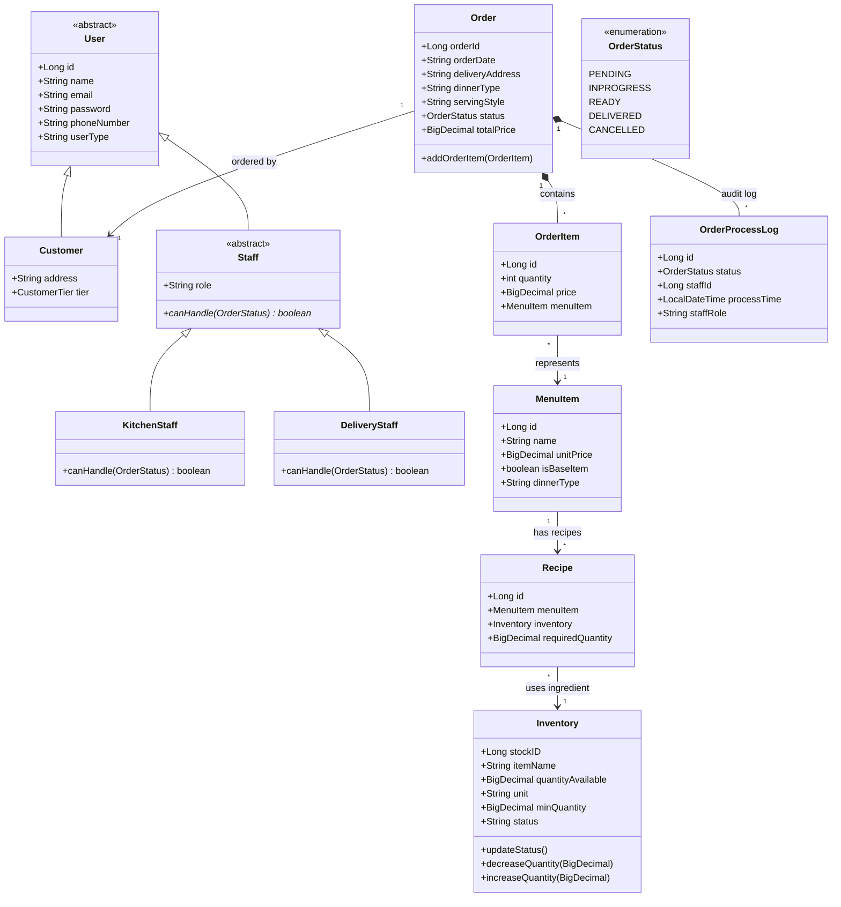
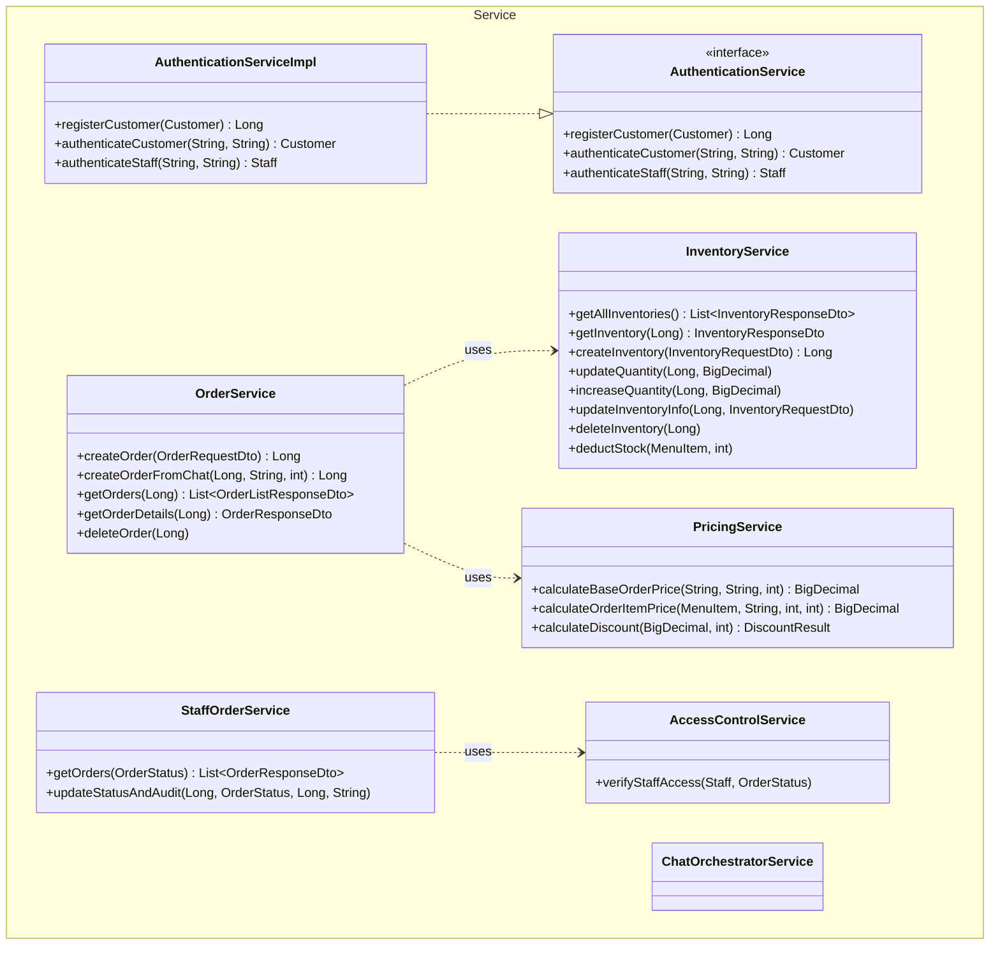
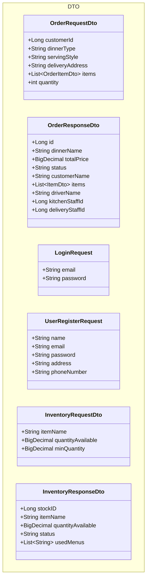

# 패키지별 상세 클래스 다이어그램 (Package-Specific Class Diagrams)

## 1. 도메인 패키지 (Domain Package)



## 2. 서비스 패키지 (Service Package)



## 3. 컨트롤러 패키지 (Controller Package)

```mermaid
classDiagram
    namespace Controller {
        class OrderController {
            +confirmOrder(OrderRequestDto) ResponseEntity
            +getOrders(Long) ResponseEntity
            +deleteOrder(Long) ResponseEntity
            +getOrderDetails(Long) ResponseEntity
        }
        class StaffOrderController {
            +getOrdersByStatus(OrderStatus) ResponseEntity
            +updateOrderStatus(Long, Map) ResponseEntity
        }
        class AuthController {
            +register(UserRegisterRequest) ResponseEntity
            +loginUsers(LoginRequest) ResponseEntity
            +loginStaffs(LoginRequest) ResponseEntity
        }
        class InventoryController {
            +getAllInventories() ResponseEntity
            +getInventory(Long) ResponseEntity
            +createInventory(InventoryRequestDto) ResponseEntity
            +updateQuantity(Long, Map) ResponseEntity
            +increaseQuantity(Long, Map) ResponseEntity
            +updateInventory(Long, InventoryRequestDto) ResponseEntity
            +deleteInventory(Long) ResponseEntity
        }
    }
    
    class Service {
        <<Simplified>>
    }
    
    class DTO {
        <<Simplified>>
    }

    OrderController ..> Service : uses
    StaffOrderController ..> Service : uses
    AuthController ..> Service : uses
    InventoryController ..> Service : uses
    
    Controller ..> DTO : uses
```

## 4. DTO 패키지 (DTO Package)



## 5. 전체 패키지 다이어그램 (Overall Package Diagram)

```mermaid
classDiagram
    namespace Controller {
        class AuthController
        class ChatController
        class CustomerController
        class InventoryController
        class MenuItemController
        class OrderController
        class StaffOrderController
    }
    
    namespace Service {
        class AuthenticationService
        class AuthenticationServiceImpl
        class ChatOrchestratorService
        class InventoryService
        class OrderService
        class StaffOrderService
        class PricingService
        class AccessControlService
    }
    
    namespace Repository {
        class CustomerRepository
        class InventoryRepository
        class MenuItemRepository
        class OrderProcessLogRepository
        class OrderRepository
        class StaffRepository
    }
    
    namespace Domain {
        class Customer
        class Staff
        class Order
        class Inventory
        class MenuItem
    }
    
    namespace DTO {
        class OrderRequestDto
        class OrderResponseDto
        class InventoryRequestDto
    }

    Controller ..> Service : uses
    Controller ..> DTO : uses
    Service ..> Repository : uses
    Service ..> Domain : uses
    Service ..> DTO : uses
    Repository ..> Domain : manages
```
